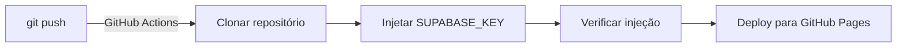

# Deploy em Produção - Granafy

## Configuração de Variáveis de Ambiente

Este documento explica como configurar o deploy automático com injeção segura de credenciais.

### 1. GitHub Secrets (Obrigatório para CI/CD)

O GitHub Actions precisa de permissão para ler a chave Supabase de forma segura.

#### Configure em: https://github.com/LevyCupira/granafy/settings/secrets/actions

**Adicionar novo secret:**

1. Clique em **"New repository secret"**
2. Name: `SUPABASE_KEY`
3. Value: Cole a chave Supabase (ex: `sb_publishable_hiH2CKVSf-he9QP_M3ByrQ_wXXbKZbf`)
4. Click **"Add secret"**

#### Chaves Necessárias:

- `SUPABASE_KEY` — Chave Supabase Publishable
- `GITHUB_TOKEN` — Gerado automaticamente pelo GitHub Actions

### 2. Fluxo de Deploy Automático

Quando você faz `git push` para a branch `main`:



### 3. Como Funciona a Injeção

O arquivo `.github/workflows/deploy.yml` executa:

```bash
sed -i "s|window.SUPABASE_KEY = window.SUPABASE_KEY || 'sb_publishable_[^']*'|window.SUPABASE_KEY = window.SUPABASE_KEY || '${{ secrets.SUPABASE_KEY }}'|g" index.html
```

**Antes (no repositório):**
```javascript
window.SUPABASE_KEY = window.SUPABASE_KEY || 'sb_publishable_hiH2CKVSf-he9QP_M3ByrQ_wXXbKZbf';
```

**Depois (no deploy):**
```javascript
window.SUPABASE_KEY = window.SUPABASE_KEY || 'sb_publishable_NOVA_CHAVE_DO_GITHUB_SECRETS';
```

### 4. Checklist de Configuração

- [ ] Secret `SUPABASE_KEY` criado no GitHub
- [ ] Valor da chave está correto
- [ ] `.github/workflows/deploy.yml` commitado
- [ ] `.gitignore` contém `.env` e `.env.local`
- [ ] Arquivo `index.html` NÃO deve ter chave hardcoded
- [ ] Fazer um teste de push para validar deploy

### 5. Verificar Status do Deploy

1. Vá para: https://github.com/LevyCupira/granafy/actions
2. Clique no último workflow
3. Verifique se passou em "Inject Supabase Key" e "Deploy to GitHub Pages"

### 6. Troubleshooting

**Erro: "SUPABASE_KEY not found"**
- Verificar se secret foi criado em Settings → Secrets → Actions
- Verificar nome exato: `SUPABASE_KEY`

**Erro: "sed command not found"**
- Workflow roda em Linux (sed está disponível por padrão)
- Se erro persistir, usar `perl` como alternativa

**Erro: "GitHub Pages not enabled"**
- Vá em: Settings → Pages
- Source: Deploy from a branch
- Branch: gh-pages
- Folder: / (root)

### 7. Opção Alternativa: Deploy Manual

Se preferir não usar GitHub Actions, pode fazer deploy manual:

```bash
# 1. Definir variável de ambiente localmente
export SUPABASE_KEY="sua_chave_aqui"

# 2. Injetar no index.html
sed -i "s|window.SUPABASE_KEY = window.SUPABASE_KEY || 'sb_publishable_[^']*'|window.SUPABASE_KEY = window.SUPABASE_KEY || '$SUPABASE_KEY'|g" index.html

# 3. Fazer commit
git add index.html
git commit -m "chore: Update Supabase key for production"

# 4. Push para GitHub Pages
git push origin main
```

### 8. Segurança

✅ **O que é seguro nesta configuração:**
- Chave nunca fica visível no repositório público
- Secrets são criptografados no GitHub
- Injeção happens apenas durante build
- Arquivo `.env` é ignorado pelo Git

⚠️ **Limitações:**
- Qualquer pessoa com acesso ao repositório pode ver o valor injetado (está no HTML)
- Para máxima segurança, manter a chave Publishable (RLS ativado no Supabase compensa)
- Regenerar chave periodicamente

### 9. Renovação Periódica

**Mensalmente:**
1. Gerar nova chave no Supabase
2. Atualizar secret no GitHub
3. Verificar funcionamento

**Quando exposta:**
1. Regenerar chave imediatamente
2. Revogar chave anterior
3. Atualizar GitHub secret
4. Force push de novo workflow (se necessário)

---

## Referências

- [GitHub Actions Secrets](https://docs.github.com/en/actions/security-guides/encrypted-secrets)
- [GitHub Pages Deploy](https://docs.github.com/en/pages/getting-started-with-github-pages/about-github-pages)
- [Supabase API Keys](https://supabase.com/docs/guides/api/api-keys-and-tokens)
